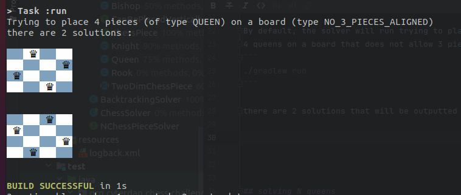

### N-Queens with a twist

This project implements a small framework for solving the classical N-Queens 
problem as well as variants on the problem.

The following problems are currently supported by the solver:
- Placing N Queens on a standard 2 dimension board
- The Board can have additional constraint such as "no 3 pieces can be placed on the same line"
- The type of piece can be easily extended (Queen, Bishop, Rook and Knight are currently implemented)

## Design considerations
Priority was given to implementing a design that is readable and can easily be extended:
  - Other pieces can be added by adding a class that implements `ChessPiece`, the behavior of the piece is encapsulated within that class
  - Further constraints can be added by implementing a sub-class of `TwoDimBoard` that specifies what checks need to be made before considering the addition of a chess piece
 - Log levels are used to allow for debugging and visibility into the solver.
Turning on debug log level (see `logback.xml`) will print a representation of the board (in color!) at each step where the solver attempts to add or remove pieces.

## Usage

By default, the solver will run trying to place
4 queens on a board that does not allow 3 pieces to be on a single line:
```
./gradlew run
```

There are 2 solutions that will be outputed to stdout (with color if supported by the terminal):



The user can tweak the problem statement by using the following options:
```Solve variants of the classical N-queens problem
  -b, --boardType=<board>   The type of board. Valid values: STANDARD,
                              NO_3_PIECES_ALIGNED
  -h, --help                Show this help message and exit.
  -n, --size=<boardSize>    The size of the board, or the number of pieces
  -p, --pieceType=<piece>   The type of chess piece to place. Valid values:
                              QUEEN, ROOK, BISHOP, KNIGHT
  -V, --version             Print version information and exit.
  ```

for example, to place 3 knights on a standard board:
```
./gradlew run --args="-p KNIGHT -n 3 -b STANDARD"
```

## Solving N queens
The provided implementation uses the standard backtracking approach
to explore the legal placements, (checking both the individual piece threatening rules, and the board specific rules)
backtracking when it has explored a branch fully until all solutions to the problem have been found.

## Limits and possible improvements
- Backtracking implementation is useful for finding all available solutions but is not efficient
if the user instead desires finding a single solution as fast as possible (an approach based on constraint programming
  would be more appropriate for that use case).
  
- The user has to wait for all solutions to be found, it would be better to report on solutions as they are found.
